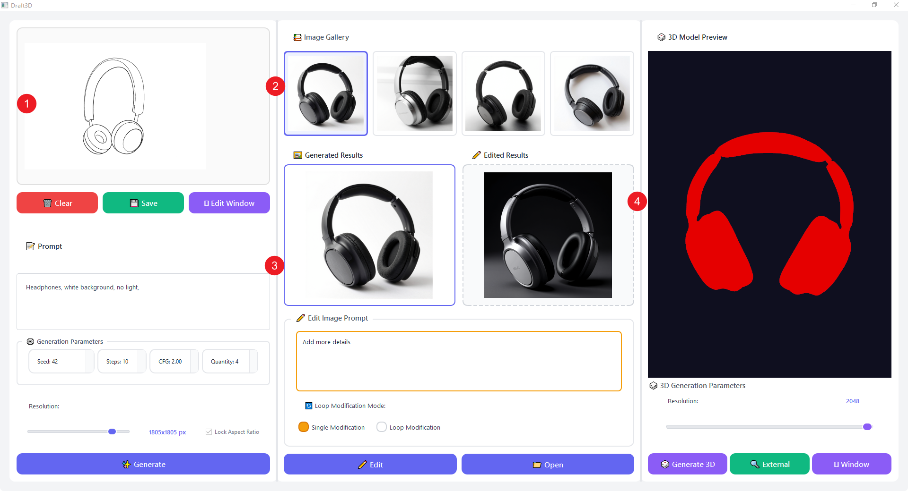

# Draft3D GUI

[](https://opensource.org/licenses/MIT)
[](https://www.python.org/downloads/)
[](#)
[](#)

An easy-to-use Qt-based graphical user interface and supporting tools for 3D content generation workflows built on top of ComfyUI.

---

## Quick Navigation

- [Key Features](#key-features)
- [How to Install](#how-to-install)
- [Quick Start](#quick-start)
- [Generation Parameters](#generation-parameters)
- [Examples](#examples)
- [Documentation](#documentation)
- [Development](#development-setup)
- [Contributing](#contributing)
- [License](#license)
- [How to Cite](#how-to-cite)

---

## Key Features

1. **🎨 Image-to-3D Pipeline**: Generate 3D models from 2D images using open-source image-to-3D generation models such as Hunyuan3D, with automatic background removal and optimization.

2. **🚀 One-Click Launch**: Batch scripts automatically start both ComfyUI backend and Draft3D GUI frontend together, eliminating manual configuration.

3. **📋 Workflow Management**: Build, save, and load ComfyUI-compatible workflows directly in the GUI. No need to manually edit JSON workflow files.

4. **🎯 Interactive 3D Visualization**: Inspect generated meshes interactively using PyVista/VTK with real-time rendering, color customization, and lighting controls.

5. **⚙️ Comprehensive Parameter Control**: Fine-tune generation parameters (seed, steps, CFG scale, resolution) with intuitive Qt widgets and real-time preview.

6. **🔄 Image Editing & Iteration**: Edit generated images with ControlNet-based workflows and loop modification mode for iterative refinement.

7. **💾 Automatic Result Management**: All generated images and 3D models are automatically saved with timestamps and organized by date for easy tracking.

8. **🔬 Research-Ready**: Repository layout is being organized to support reproducibility, documentation, and long-term maintainability for academic research and future research-software publication.

---

## How to Install

### Prerequisites

- **Operating System**: Windows 10 or later (Linux/macOS supported with script adaptations)
- **Python**: 3.9 or higher (3.10+ recommended)
- **ComfyUI**: Standard installation required in `ComfyUI/` folder
- **Hardware**: NVIDIA GPU recommended (CPU-only operation possible but slower)

### ComfyUI models & custom nodes (Hunyuan3D + Z-Image-Turbo)

Draft3D relies on specific ComfyUI workflows for **sketch-conditioned image generation (Z-Image-Turbo)** and **image-to-3D generation (Hunyuan3D)**. Before running Draft3D, make sure your ComfyUI installation has:

1. **Required model files (place under `ComfyUI/models/` according to ComfyUI conventions)**
   - **Hunyuan3D (3D generation)**:
     - `hunyuan_3d_v2.1.safetensors`
   - **Z-Image-Turbo (image generation / sketch-to-image)**:
     - `z_image_turbo_bf16.safetensors`
     - `ae.safetensors`
     - `qwen_3_4b.safetensors`
     - `Z-Image-Turbo-Fun-Controlnet-Union.safetensors`
     - `lumina2.safetensors`

2. **Required custom nodes**
   - Install the ComfyUI node packs that provide the workflow node types used by Draft3D (for example Hunyuan3D v2 nodes and Z-Image-Turbo / AuraFlow-related nodes such as `ModelSamplingAuraFlow`, `UNETLoader`, `ModelPatchLoader`, `EmptyLatentHunyuan3Dv2`, `VAEDecodeHunyuan3D`, `SaveGLB`, etc.).
   - The easiest way is typically to install **ComfyUI-Manager**, start ComfyUI once, and then install missing custom nodes when ComfyUI reports “missing node” / “unknown `class_type`”.

**Quick verification**

- Start ComfyUI and confirm it launches without errors.
- In Draft3D GUI, run a small **image generation** (few steps, low resolution) and ensure images are produced.
- Then run **Generate 3D** once and confirm a `.glb` is saved under `generated_images/` (file prefix `ComfyUI_Hunyuan3D`).

### Quick Installation

1. **Clone or download** this repository
2. **Place ComfyUI** in the `ComfyUI/` folder at project root
3. **Run the setup script**:
   ```bat
   RunAll.bat
   ```
   This will automatically:
   - Create a virtual environment
   - Install all dependencies
   - Start ComfyUI backend
   - Launch Draft3D GUI

### Detailed Installation

See [Complete Setup Guide](#complete-setup-guide-step-by-step) for step-by-step instructions including environment verification and troubleshooting.

---

## Quick Start

### Option 1: One-Click Launch (Recommended) ⚡

Simply double-click `RunAll.bat` in the project root. The script handles everything automatically.

### Workflow Overview (GUI Operation Flow)

The following figure shows the typical Draft3D end-to-end workflow inside the GUI:



1. **Sketch input**: Draw or load a sketch in the left sketch canvas.
2. **Image gallery selection**: Browse generated candidates and select one image from the gallery.
3. **Result confirmation**: Preview the selected generated image in the main result panel (used as the input for downstream steps).
4. **3D generation & preview**: Run the image-to-3D step and inspect the resulting 3D model in the right preview panel (with adjustable 3D parameters).

### Option 2: Manual Launch

**Terminal 1 - Start ComfyUI:**
```bat
call venv\Scripts\activate.bat
cd ComfyUI
python main.py
```

**Terminal 2 - Start GUI:**
```bat
call venv\Scripts\activate.bat
python GUI.py
```

### First Steps

1. **Generate an Image**: Enter a prompt, adjust parameters, and click "✨ Generate"
2. **Select an Image**: Click on any generated image in the gallery to view it
3. **Generate 3D Model**: Select an image and click "🎲 Generate 3D" (takes 2-10 minutes)
4. **View 3D Model**: The 3D model will appear in the preview panel with interactive controls

For detailed parameter explanations, see [Generation Parameters](#generation-parameters).

---

## Complete Setup Guide (Step-by-Step) 📚

If you prefer to understand each step or need to set up from scratch (including ComfyUI), this section provides detailed, step-by-step instructions.

### Prerequisites and System Requirements 📋

Before diving into the installation process, let's ensure you have everything needed to run Draft3D GUI smoothly. This section will guide you through checking and preparing your environment step by step.

### What You Need ✨

To run Draft3D GUI, you'll need the following components:

#### **💻 Operating System**
- **Windows 10 or later** (the provided batch scripts are designed for Windows `.bat` files)
- If you're on Linux or macOS, you can still use the project, but you'll need to adapt the launch scripts or run the Python commands directly

#### **🐍 Python Environment**
- **Python 3.9 or higher** (Python 3.10 or 3.11 recommended for best compatibility)
  - You can check your Python version by running `python --version` in a terminal
  - If you don't have Python installed, download it from [python.org](https://www.python.org/downloads/)
  - **⚠️ Important**: During installation, make sure to check "Add Python to PATH" to enable command-line access

#### **📦 Python Dependencies**
The following packages are required and will be automatically installed when you follow the setup instructions:

- **Core dependencies** (from `requirements.txt`):
  - `numpy` (≥1.21) - Numerical computing and array operations
  - `requests` (≥2.28) - HTTP communication with ComfyUI backend
  - `PySide6` (≥6.5) - Qt-based GUI framework (primary)
  - `PyQt5` (≥5.15) - Optional fallback Qt binding
  - `pyvista` (≥0.43) - 3D mesh visualization and manipulation
  - `pyvistaqt` (≥0.11) - PyVista integration with Qt
  - `vtk` (≥9.2) - Visualization Toolkit for 3D graphics
  - `pillow` (≥9.5) - Image processing
  - `rembg` (≥2.0) - Background removal for 3D generation

#### **🔧 ComfyUI Backend**
- A standard **ComfyUI installation** must be placed in the `ComfyUI/` folder at the project root
- ComfyUI serves as the backend engine that performs the actual image and 3D model generation
- If you don't have ComfyUI yet, you'll need to set it up first (see Section 3.2 for details)

#### **💾 Hardware Recommendations**
- **🎮 GPU**: NVIDIA GPU with CUDA support is highly recommended for faster generation (though CPU-only operation is possible)
- **🧠 RAM**: At least 8GB RAM (16GB recommended for high-resolution generation)
- **💿 Storage**: Several GB of free space for models, generated images, and dependencies

### Verifying Your Environment ✅

Before proceeding with installation, let's verify that your system meets the requirements. Follow these quick checks to ensure everything is ready:

#### **🐍 Check Python Installation**

1. **Open a terminal** (PowerShell on Windows, or Terminal on Linux/macOS)

2. **Check Python version**:
   ```bat
   python --version
   ```
   or
   ```bat
   python3 --version
   ```
   
   You should see output like `Python 3.9.x`, `Python 3.10.x`, or `Python 3.11.x`. If you see an error or a version below 3.9, you'll need to install or update Python. ❌

3. **Check pip (Python package manager)**:
   ```bat
   pip --version
   ```
   or
   ```bat
   python -m pip --version
   ```
   
   Pip should be automatically included with Python 3.9+. If you see an error, you may need to reinstall Python with the "pip" option enabled.

#### **💿 Check Available Disk Space**

Ensure you have sufficient disk space:
- **Minimum**: 5-10 GB for dependencies and ComfyUI models
- **Recommended**: 20+ GB for comfortable operation with multiple models and generated content

You can check disk space on Windows by:
- Opening File Explorer
- Right-clicking on your drive → Properties
- Checking "Free space"

#### **🎮 Check GPU (Optional but Recommended)**

If you have an NVIDIA GPU, verify CUDA support:

1. **Check GPU model**:
   ```bat
   nvidia-smi
   ```
   
   This command displays your GPU information and CUDA version. If the command is not found, you may not have NVIDIA drivers installed, or you're using a different GPU vendor.

2. **💡 Note**: Draft3D GUI can run on CPU, but generation will be significantly slower. GPU acceleration is highly recommended for practical use.

#### **🔧 Check ComfyUI Installation**

Verify that ComfyUI is set up (if you already have it):

1. **Check if `ComfyUI/` folder exists** in the project root directory
2. **Verify ComfyUI structure**: The folder should contain:
   - `main.py` (ComfyUI entry point)
   - `models/` directory (for AI models)
   - Other ComfyUI files and folders

If ComfyUI is not yet installed, don't worry—we'll guide you through setting it up in Section 3.2. 😊

#### **✅ Quick Environment Checklist**

Before moving to installation, confirm:

- [ ] Python 3.9+ is installed and accessible from command line
- [ ] pip is available and working
- [ ] Sufficient disk space (10+ GB recommended)
- [ ] (Optional) NVIDIA GPU with drivers installed
- [ ] (If applicable) ComfyUI folder exists in project root

If all checks pass, you're ready to proceed to the installation section! 🎉 If any checks fail, address those issues first before continuing.

### Why Use a Virtual Environment? 🏗️

We **strongly recommend** using a Python virtual environment (`venv`) to isolate Draft3D's dependencies from your system Python installation. This practice:

- **🛡️ Prevents conflicts**: Avoids version conflicts with other Python projects
- **🔬 Ensures reproducibility**: Creates a consistent environment that matches the project requirements
- **🧹 Simplifies cleanup**: You can easily remove the entire environment if needed
- **✨ Follows best practices**: Aligns with modern Python packaging standards and common research-software publication practices

Don't worry if you're new to virtual environments—the setup process will guide you through creating one automatically. 😊

---

### Quick Start (Recommended for First-Time Users) ⚡

If you're eager to see Draft3D GUI in action and have ComfyUI already set up, follow these steps:

#### **Step 1: Verify Your Environment ✅**

First, let's make sure Python is available:

1. Open a terminal (PowerShell or CMD on Windows)
2. Navigate to the project directory:
   ```bat
   cd path\to\Draft3D\GUI
   ```
3. Check Python version:
   ```bat
   python --version
   ```
   You should see Python 3.9 or higher. If not, please install Python first.

#### **Step 2: One-Click Launch (Easiest Method) 🎯**

The simplest way to start Draft3D GUI is using the provided batch script:

1. **Double-click `RunAll.bat`** in the project root folder

   This script will:
   - ✨ Automatically create a virtual environment (`venv`) if it doesn't exist
   - 📦 Install all required dependencies (on first run)
   - 🚀 Start the ComfyUI backend
   - ⏳ Wait for the backend to initialize
   - 🎨 Launch the Draft3D GUI frontend

2. **On the first run**, the script may take a few minutes to:
   - Create the virtual environment
   - Download and install Python packages
   - Initialize ComfyUI

3. **Subsequent runs** will be much faster, as dependencies are already installed. ⚡

#### **Step 3: Verify Everything Works ✅**

After launching, you should see:
- A console window running ComfyUI (backend)
- The Draft3D GUI window (frontend)

If both appear, congratulations! 🎉 You're ready to start generating. If you encounter any issues, please refer to Section 3.3 (Troubleshooting) or Section 4 (Complete Setup Guide) for detailed setup instructions.

---

#### **Step 1: Prepare ComfyUI Backend 🔧**

Draft3D GUI requires ComfyUI to be installed in the `ComfyUI/` folder at the project root.

1. **If you already have ComfyUI installed elsewhere:**
   - Copy or create a symbolic link to your ComfyUI installation in the project root
   - The folder structure should look like:
     ```
     Draft3D/GUI/
     ├── ComfyUI/          ← ComfyUI installation goes here
     │   ├── main.py
     │   ├── models/
     │   └── ...
     ├── GUI.py
     ├── README.md
     └── ...
     ```

2. **If you need to install ComfyUI:**
   - Clone or download ComfyUI from the [official repository](https://github.com/comfyanonymous/ComfyUI)
   - Place it in the `ComfyUI/` folder at the project root
   - Follow ComfyUI's installation instructions to set up models and dependencies

#### **Step 2: Create Python Virtual Environment**

Let's create an isolated Python environment for Draft3D:

1. **Open a terminal** (PowerShell or CMD) in the project root directory

2. **Create the virtual environment:**
     ```bat
     python -m venv venv
   ```
   This creates a `venv` folder containing a fresh Python environment.

3. **Activate the virtual environment:**
   ```bat
     call venv\Scripts\activate.bat
     ```
   You should see `(venv)` appear at the beginning of your command prompt, indicating the environment is active. ✅

   > **💡 Note for Linux/macOS users**: Use `source venv/bin/activate` instead.

#### **Step 3: Install Python Dependencies 📦**

With the virtual environment activated, install the required packages:

1. **Upgrade pip** (recommended for best compatibility):
   ```bat
   python -m pip install --upgrade pip
   ```

2. **Install dependencies from requirements.txt:**
   ```bat
     pip install -r requirements.txt
     ```
   This will download and install all required packages. The process may take several minutes depending on your internet connection.

   You should see output like:
   ```
   Collecting numpy>=1.21
   Collecting requests>=2.28
   Collecting PySide6>=6.5
   ...
   Successfully installed numpy-1.24.3 requests-2.31.0 ...
   ```

3. **Verify installation** (optional but recommended):
   ```bat
   pip list
   ```
   You should see all the required packages listed.

#### **Step 4: (Optional) Install Project in Editable Mode 🔧**

If you plan to modify the source code or contribute to the project:

```bat
     pip install -e .
     ```

This installs the `draft3d` and `draft3d_gui` packages in editable mode, meaning changes to the source code take effect immediately without reinstalling.

#### **Step 5: Launch the Application 🚀**

You have two options for launching:

**Option A: Use the batch scripts (Recommended) 🎯**
- **Start both backend and frontend**: Double-click `RunAll.bat`
- **Start only GUI**: Double-click `LaunchGUI.bat` (if ComfyUI is already running)
- **Start only ComfyUI**: Double-click `LaunchComfyUI.bat`

**Option B: Manual launch (For development) 💻**
1. **Start ComfyUI backend** (in one terminal):
   ```bat
   call venv\Scripts\activate.bat
   cd ComfyUI
   python main.py
   ```

2. **Start Draft3D GUI** (in another terminal):
   ```bat
   call venv\Scripts\activate.bat
   python GUI.py
   ```

#### **Step 6: Verify the Setup ✅**

After launching, you should see:
- ComfyUI backend running (console output showing "Starting server...")
- Draft3D GUI window open
- No error messages in the console

If everything works, you're all set! 🎉 If you encounter issues, see the troubleshooting section below.

---

### Troubleshooting Common Issues 🔧

If you run into problems during setup, here are some common issues and solutions:

#### **❌ Issue: "Python is not recognized"**
- **✅ Solution**: Python is not in your system PATH. Reinstall Python and make sure to check "Add Python to PATH" during installation.

#### **❌ Issue: "pip install" fails with permission errors**
- **✅ Solution**: Make sure you're using the virtual environment's pip. Activate the venv first with `call venv\Scripts\activate.bat`.

#### **❌ Issue: "ModuleNotFoundError" when running GUI.py**
- **✅ Solution**: Dependencies are not installed. Run `pip install -r requirements.txt` in the activated virtual environment.

#### **❌ Issue: ComfyUI connection errors**
- **✅ Solution**: 
  - Make sure ComfyUI is running (check the console window)
  - Verify ComfyUI is accessible at `http://127.0.0.1:8188`
  - Check that the `ComfyUI/` folder exists in the project root

#### **❌ Issue: GUI window doesn't appear**
- **✅ Solution**: 
  - Check the console for error messages
  - Verify PySide6 is installed: `pip install PySide6`
  - Try running `python GUI.py` directly to see detailed error output

#### **❌ Issue: Out of memory errors during generation**
- **✅ Solution**: 
  - Reduce the resolution parameter (try 512 instead of 1024)
  - Reduce the batch size (Quantity parameter)
  - Close other applications to free up GPU/RAM

---

## Alternative Launch Methods 🚀

This section describes the different ways you can launch Draft3D GUI, depending on your workflow and preferences.

### One-Click Launch: `RunAll.bat` (Recommended) ⚡

The simplest way to start everything at once:

**Usage**: Double-click `RunAll.bat` in the project root

**What it does**:
1. ✨ Creates `venv` if it doesn't exist
2. 🔧 Activates the virtual environment
3. 🚀 Starts ComfyUI backend (in a separate console window)
4. ⏳ Waits ~8 seconds for ComfyUI to initialize
5. 🎨 Launches Draft3D GUI frontend (in another console window)

**Best for**: First-time users, daily usage, when you want both backend and frontend running

**💡 Note**: Two separate console windows will open—one for ComfyUI and one for the GUI. This makes it easier to monitor logs and debug issues.

### Launch GUI Only: `LaunchGUI.bat` 🎨

Use this when ComfyUI is already running (e.g., from a previous session):

**Usage**: Double-click `LaunchGUI.bat` in the project root

**What it does**:
1. Checks for `venv`, creates it if needed
2. Activates the virtual environment
3. Runs `GUI.py` to open the GUI window

**Best for**: When you've already started ComfyUI manually, or when debugging the GUI separately

### Launch ComfyUI Only: `LaunchComfyUI.bat` 🔧

Use this to start only the ComfyUI backend:

**Usage**: Double-click `LaunchComfyUI.bat` in the project root

**What it does**:
1. Creates/activates `venv` if needed
2. Changes to the `ComfyUI/` directory
3. Runs `ComfyUI/main.py` to start the backend server
4. Optionally opens `http://127.0.0.1:8188` in your browser

**Best for**: When you want to access ComfyUI's web interface, or when debugging the backend separately

### Manual Launch (For Advanced Users) 💻

If you prefer command-line control or are developing:

**Terminal 1 - Start ComfyUI:**
```bat
call venv\Scripts\activate.bat
cd ComfyUI
python main.py
```

**Terminal 2 - Start GUI:**
```bat
call venv\Scripts\activate.bat
python GUI.py
```

**Best for**: Development, debugging, or when you need fine-grained control over the launch process

---

## Generation Parameters ⚙️

Draft3D GUI provides comprehensive parameter controls for both image generation and 3D model generation. Understanding these parameters is essential for achieving the desired output quality and style.

### Image Generation Parameters 🎨

The following parameters control the image generation process:

#### **🎲 Seed (Random Seed)**
- **Range**: `0` to `2,147,483,647` (2³¹ - 1)
- **Default**: `42`
- **Description**: The random seed determines the initial noise pattern used by the diffusion model. Using the same seed with identical other parameters will produce the same image, enabling reproducible results.
- **Usage Tips** 💡:
  - Use a fixed seed (e.g., `42`) to reproduce a specific result 🔄
  - Use `-1` or random values to generate diverse variations 🎨
  - For batch generation, each image in the batch uses a different seed derived from the base seed

#### **⚡ Steps (Sampling Steps)**
- **Range**: `1` to `100`
- **Default**: `8`
- **Description**: The number of denoising steps the model performs. More steps generally lead to higher quality but take longer to generate.
- **Usage Tips** 💡:
  - **Low steps (4-8)**: Fast generation, suitable for quick previews and testing 🚀
  - **Medium steps (8-20)**: Good balance between quality and speed, recommended for most use cases ⚖️
  - **High steps (20-50)**: Higher quality, but diminishing returns beyond 30 steps ✨
  - When using ControlNet (sketch-based generation), the minimum is automatically set to 9 steps

#### **🎯 CFG (Classifier-Free Guidance Scale)**
- **Range**: `0.1` to `20.0`
- **Default**: `2.0`
- **Step Size**: `0.1`
- **Description**: Controls how strongly the model adheres to the prompt. Higher values make the output more closely match the prompt, but can reduce creativity and diversity.
- **Usage Tips** 💡:
  - **Low CFG (1.0-2.0)**: More creative and diverse outputs, less strict adherence to prompt 🎨
  - **Medium CFG (2.0-5.0)**: Balanced approach, good for most scenarios (recommended: `2.0`) ⚖️
  - **High CFG (5.0-10.0)**: Strong prompt adherence, may produce over-saturated or less natural results 📌
  - **Very High CFG (10.0+)**: Usually not recommended, can cause artifacts ⚠️

#### **📦 Quantity (Batch Size)**
- **Range**: `1` to `10`
- **Default**: `1`
- **Description**: The number of images to generate in a single batch. All images share the same prompt and parameters but use different random seeds.
- **Usage Tips** 💡:
  - Generate multiple variations quickly by setting quantity > 1 🚀
  - Each additional image increases generation time proportionally ⏱️
  - Useful for exploring different interpretations of the same prompt 🔍

#### **📐 Resolution (Image Size)**
- **Range**: `256` to `2048` pixels
- **Default**: `512` pixels
- **Step Size**: `64` pixels
- **Aspect Ratio**: Always square (width = height)
- **Description**: The output image dimensions. Higher resolutions produce more detail but require more memory and computation time.
- **Usage Tips** 💡:
  - **Low resolution (256-512)**: Fast generation, suitable for quick tests and previews 🚀
  - **Medium resolution (512-1024)**: Good balance, recommended for most use cases ⚖️
  - **High resolution (1024-2048)**: Maximum detail, requires more GPU memory and time ✨
  - 💡 Note: The aspect ratio is locked to maintain square images (1:1 ratio)

### 3D Model Generation Parameters 🎲

The following parameters control the 3D model generation process:

#### **📐 Resolution (3D Model Resolution)**
- **Range**: `512` to `2048`
- **Default**: `1024`
- **Step Size**: `256`
- **Description**: Controls the resolution/detail level of the generated 3D model. Higher values produce more detailed meshes but require more computation time and memory.
- **Usage Tips** 💡:
  - **Low resolution (512-1024)**: Faster generation, suitable for quick previews 🚀
  - **Medium resolution (1024)**: Good balance, recommended default ⚖️
  - **High resolution (1536-2048)**: Maximum detail, best for final outputs but slower (2-10 minutes typical) ✨
  - ⏱️ Note: 3D generation is significantly slower than image generation (typically 2-10 minutes)

#### **📝 Additional 3D Generation Notes**
- **🎨 Background Removal**: By default, the system automatically removes the background from the input image before generating the 3D model, which improves results for object-focused images
- **🔧 Seed, Steps, and CFG**: 3D generation uses fixed optimized values (seed: `952805179515179`, steps: `30`, CFG: `5.0`) that are not user-adjustable in the current version

### How to Adjust Parameters 🎛️

#### **In the GUI Interface 💻**

1. **Image Generation Parameters** (Left Panel):
   - **Seed, Steps, CFG, Quantity**: Use the spin boxes (up/down arrows) or click and type directly
   - **Resolution**: Drag the slider left/right, or click on the slider track to jump to a value
   - The current values are displayed next to each control

2. **3D Generation Parameters** (Right Panel):
   - **Resolution**: Drag the slider to adjust (range: 512-2048)
   - The current value is displayed next to the slider

#### **Parameter Adjustment Workflow**

1. **Start with Defaults**: Begin with the default parameter values to establish a baseline
2. **Adjust One at a Time**: Change one parameter at a time to understand its effect
3. **Iterate and Refine**: Generate multiple variations with different parameter combinations
4. **Save Successful Configurations**: The GUI automatically saves your parameter preferences in `gui_config.json`

#### **💡 Recommended Parameter Combinations**

**🚀 For Quick Testing:**
- Steps: `4-8`
- CFG: `2.0`
- Resolution: `512x512`
- Quantity: `1`

**✨ For High Quality Images:**
- Steps: `12-20`
- CFG: `2.0-3.0`
- Resolution: `1024x1024`
- Quantity: `1-4`

**🎲 For 3D Models:**
- Resolution: `1024` (balanced) or `2048` (maximum quality)
- Allow 2-10 minutes for generation ⏱️

#### **🔗 Understanding Parameter Interactions**

- **Steps vs. CFG**: Higher steps improve detail, while higher CFG improves prompt adherence. They work together but serve different purposes.
- **Resolution vs. Steps**: Higher resolution benefits more from additional steps, but the relationship is not linear.
- **Seed vs. Quantity**: When generating multiple images (Quantity > 1), each image uses a different seed derived from your base seed, ensuring variety while maintaining reproducibility.

#### **🔧 Troubleshooting**

- **❌ Images too blurry**: ✅ Increase Steps (try 12-20) or Resolution (try 1024)
- **❌ Images don't match prompt**: ✅ Increase CFG (try 3.0-5.0)
- **❌ Images too similar**: ✅ Change Seed or increase Quantity
- **❌ Generation too slow**: ✅ Reduce Steps, Resolution, or Quantity
- **❌ Out of memory errors**: ✅ Reduce Resolution or Quantity

---

## 5. Development Setup

If you plan to extend Draft3D, contribute to the repository, or modify the source code, this section will guide you through setting up a development environment.

### 5.1 Why Editable Installation?

When developing, you'll want your code changes to take effect immediately without reinstalling the package. This is achieved through **editable installation** (also known as "development mode").

### 5.2 Setting Up Development Environment

#### **Step 1: Ensure Virtual Environment is Active**

If you haven't already, create and activate the virtual environment:

```bat
python -m venv venv
call venv\Scripts\activate.bat
```

> **Tip**: If you've already created `venv` via the batch scripts, you can simply activate it with `call venv\Scripts\activate.bat`.

#### **Step 2: Install Dependencies**

Make sure all runtime dependencies are installed:

```bat
pip install -r requirements.txt
```

#### **Step 3: Install Project in Editable Mode**

This is the key step for development. Install the project so that changes to source code are immediately available:

```bat
pip install -e .
```

**What this does**:
- Installs all dependencies from `pyproject.toml`
- Registers the `draft3d` and `draft3d_gui` packages in editable mode
- Creates symbolic links so Python imports your local source code directly

**Verify the installation**:

You should now be able to import the packages in Python:

```python
import draft3d
import draft3d_gui
```

#### **Step 4: Test Your Development Setup**

1. **Make a small change** to a file in `src/draft3d/` or `src/draft3d_gui/`
2. **Run the GUI**:
   ```bat
   python GUI.py
   ```
3. **Verify your changes** appear in the running application

If changes are reflected immediately, your development environment is set up correctly!

### 5.3 Development Workflow

**Recommended workflow for making changes**:

1. **Activate the virtual environment**:
   ```bat
   call venv\Scripts\activate.bat
   ```

2. **Make your code changes** in `src/draft3d/` or `src/draft3d_gui/`

3. **Test your changes**:
   ```bat
python GUI.py
```
   (No reinstallation needed thanks to editable mode!)

4. **Run tests** (if available):
   ```bat
   pytest tests/
   ```

### 5.4 Project Structure for Developers

Understanding the codebase structure will help you navigate and contribute:

- **`src/draft3d/`**: Core logic, independent of GUI
  - `comfy_client.py`: Communication with ComfyUI API
  - `workflows.py`: Workflow construction
  - `operations.py`: Image and 3D generation operations
  - `io_utils.py`: File I/O utilities
  - `config.py`: Configuration management

- **`src/draft3d_gui/`**: Qt-based GUI components
  - `main_window.py`: Main application window
  - `app.py`: Application entry point

- **`GUI.py`**: Legacy monolithic implementation (being gradually refactored)

- **`tests/`**: Unit and integration tests (to be populated)

### 5.5 Future Entry Points

In future refactors, the GUI entry point may move into the `draft3d_gui` package:

```bash
python -m draft3d_gui
```

This README will be updated accordingly when that happens.

---

## Examples

Example workflows and use cases will be provided in the `examples/` directory, including:

- **Basic Image Generation**: Simple text-to-image workflows
- **Image-to-3D Pipeline**: Complete workflow from image to 3D model
- **Image Editing**: ControlNet-based image modification examples
- **Parameter Optimization**: Best practices for different use cases

> 📝 **Note**: Examples directory is being populated. Check back soon or see the [Documentation](#documentation) section for detailed usage examples.

---

## Documentation

### User Documentation

- **[Complete Setup Guide](#complete-setup-guide-step-by-step)**: Detailed installation and configuration instructions
- **[Generation Parameters](#generation-parameters)**: Comprehensive parameter reference guide
- **[Troubleshooting](#troubleshooting-common-issues)**: Common issues and solutions

### Developer Documentation

- **[Development Setup](#development-setup)**: Setting up a development environment
- **[Project Structure](#project-structure)**: Codebase organization and architecture
- **[Contributing Guidelines](#contributing)**: How to contribute to the project

### API Documentation

The core packages (`draft3d` and `draft3d_gui`) are documented with docstrings. Key modules:

- `draft3d.comfy_client`: ComfyUI API communication
- `draft3d.workflows`: Workflow construction utilities
- `draft3d.operations`: Image and 3D generation operations
- `draft3d.io_utils`: File I/O utilities

---

## Project Structure 📁

The repository layout is being organized to support reproducibility and clear separation between **core logic** and **GUI components**:

```
Draft3D-GUI/
├── src/
│   ├── draft3d/          # Core, GUI-independent logic
│   │   ├── comfy_client.py
│   │   ├── workflows.py
│   │   ├── operations.py
│   │   └── io_utils.py
│   └── draft3d_gui/      # Qt-based GUI components
│       ├── main_window.py
│       └── app.py
├── scripts/              # Launch scripts
├── examples/             # Example workflows (to be populated)
├── data/                 # Example datasets (to be populated)
├── GUI.py                # Main GUI entry point (legacy, being refactored)
├── pyproject.toml        # Python packaging configuration
├── requirements.txt       # Runtime dependencies
├── LICENSE.txt           # MIT License
└── README.md             # This file
```

**Key Components**:
- **`src/draft3d/`**: Core logic for ComfyUI interaction, workflow management, and file operations
- **`src/draft3d_gui/`**: Qt-based GUI built on top of `draft3d`
- **`GUI.py`**: Current monolithic implementation (gradually being refactored)

---

## Research-Software Packaging and Documentation 📚

This repository is being organized to support documentation, reproducibility, and open-source distribution in line with common research-software publication practices.

- **Clear module and directory separation**:
  - Core reusable logic (`draft3d`) is separated from GUI-related code (`draft3d_gui`) into two distinct packages.
  - The core package can, in principle, be used without the GUI (e.g., from command-line tools or scripts).

- **Modern Python packaging**:
  - Uses `pyproject.toml` + `setuptools` (PEP 517) for building and publishing.
  - Declares dependencies, author information, and project homepage in a standard, machine-readable way.

- **Reproducibility and portability**:
  - Encourages the use of virtual environments (`venv`) to avoid interference from system Python installations.
  - Plans to populate `examples/` and `data/` with complete samples and datasets that correspond to the experiments described in the accompanying manuscript.

- **Licensing and documentation**:
  - Provides a top-level `README.md` and `LICENSE.txt`.
  - Uses the OSI-approved MIT License, a widely used open-source license for research software.

This README will be updated alongside ongoing refactoring and article preparation, including detailed instructions for reproducing experiments and versioned release notes where appropriate.

---

## Contributing 🤝

Contributions are welcome! The project is under active development and refactoring. Areas where contributions are particularly appreciated:

- 🔧 **Code Refactoring**: Migrating functionality from `GUI.py` into modular packages
- 🎨 **UI/UX Improvements**: Enhancing 3D visualization, parameter panels, and user interactions
- 📚 **Documentation**: Adding examples, tutorials, and improving documentation
- 🐛 **Bug Reports**: Reporting issues and helping fix them
- 💡 **Feature Requests**: Suggesting new features and improvements

### How to Contribute

1. **Fork** this repository and create a feature branch
2. **Set up** a development environment (see [Development Setup](#development-setup))
3. **Make** your changes and test them locally
4. **Submit** a Pull Request with a clear description of changes

For detailed guidelines, see the [Development Setup](#development-setup) section.

---

## License 📄

Draft3D GUI is released under the **MIT License**.

Copyright (c) 2026 Draft3D Authors

Permission is hereby granted, free of charge, to any person obtaining a copy of this software and associated documentation files (the "Software"), to deal in the Software without restriction, including without limitation the rights to use, copy, modify, merge, publish, distribute, sublicense, and/or sell copies of the Software, and to permit persons to whom the Software is furnished to do so, subject to the following conditions:

The above copyright notice and this permission notice shall be included in all copies or substantial portions of the Software.

THE SOFTWARE IS PROVIDED "AS IS", WITHOUT WARRANTY OF ANY KIND, EXPRESS OR IMPLIED, INCLUDING BUT NOT LIMITED TO THE WARRANTIES OF MERCHANTABILITY, FITNESS FOR A PARTICULAR PURPOSE AND NONINFRINGEMENT.

> ✅ This is an OSI-approved open-source license compatible with SoftwareX requirements.

For the full license text, see [LICENSE.txt](LICENSE.txt).

---

## How to Cite

If you use Draft3D GUI in academic work, please cite the software repository (or a versioned software release, if available).

### Software citation (recommended for now)

**BibTeX:**
```bibtex
@software{draft3d_gui_2026,
  author = {Song, Jiatian and Zhang, Jianmin},
  title  = {{Draft3D GUI}: A Qt-based graphical user interface for sketch-conditioned multi-stage 2D-to-3D concept generation},
  year   = {2026},
  url    = {https://github.com/tian-works/Draft3D},
  note   = {Research software repository}
}
```

**Affiliation:**

- Jiatian Song; Jianmin Zhang*  
  Guizhou University, Guiyang, China

---

## Acknowledgments

- Built on top of [ComfyUI](https://github.com/comfyanonymous/ComfyUI) for AI model inference
- Uses [PySide6](https://www.qt.io/qt-for-python) for GUI framework
- 3D visualization powered by [PyVista](https://docs.pyvista.org/) and [VTK](https://vtk.org/)

---

## Back to Top ↥

[Return to Quick Navigation](#quick-navigation)

