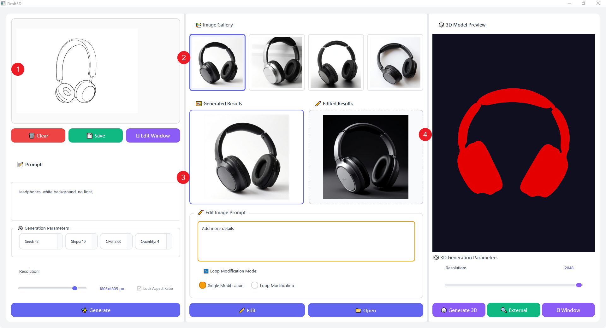

# Draft3D

[](https://opensource.org/licenses/MIT)
[](https://www.python.org/downloads/)

Draft3D is an open-source local software platform for **sketch-conditioned multi-stage 2D-to-3D concept generation**, built on top of ComfyUI.

The Python-based implementation provides a cross-platform implementation basis. After installing the required dependencies, the software can run on Windows, Ubuntu, and macOS. The main workflow has been additionally tested on Ubuntu and macOS. Platform-specific dependency differences (GPU drivers, CUDA/Metal support, GUI stack, and model components) may still affect deployment experience.

## Key Features

- **Sketch → image → 3D**: sketch-conditioned image generation (Z-Image-Turbo) and image-to-3D generation (Hunyuan3D)
- **One-click launch**: platform-specific scripts start ComfyUI backend + Draft3D GUI together
- **Interactive preview**: image gallery + 3D preview for inspecting results

## Quick Start

下面的步骤分为两类：

- **普通用户（推荐）**：直接使用“一键运行”脚本（Windows: `RunAll.bat`；Ubuntu/macOS: `RunAll.sh`）
- **开发者/研究复现**：使用 git 克隆（含 submodule），再运行对应平台的一键脚本

### 方式 A：普通用户一键运行（推荐）

1. **获取代码**
   - 方式 1：在 GitHub 页面点击 “Code → Download ZIP”，解压到**纯英文路径**（尽量避免中文/空格/过深目录）
   - 方式 2：按下方“方式 B”使用 git 克隆

2. **一键启动（Windows）**
   - 直接双击运行：

```bat
RunAll.bat
```

首次运行预期行为：

- 自动创建虚拟环境 `venv/`
- 自动安装 Draft3D 依赖与 ComfyUI 依赖（首次可能需要几分钟，取决于网络与硬盘速度）
- 自动启动 ComfyUI（默认 `http://127.0.0.1:8188`）并启动 Draft3D GUI

若你看到 GUI 正常打开，同时浏览器能访问 `http://127.0.0.1:8188`，说明“一键运行”已经成功。

**模型与节点依赖：** Draft3D 将图像生成与 3D 重建交给本机 ComfyUI 执行，因此需要把对应 **权重文件** 放到 `ComfyUI/models/`（并按工作流安装 **自定义节点**）。一键脚本只会安装 Python 依赖并启动服务，**不会自动下载大型模型**。首次完整跑通 Sketch→Image→3D 前，请按 [`docs/COMFYUI_SETUP.md`](docs/COMFYUI_SETUP.md) 准备模型与节点；若生成失败或报错缺模型，也在该文档与 [`docs/TROUBLESHOOTING.md`](docs/TROUBLESHOOTING.md) 中排查。

在 Ubuntu/macOS（bash）：

```bash
bash RunAll.sh
```

### 方式 B：开发者克隆（含 submodules）

1. **Clone with submodules**:

```bat
git clone --recurse-submodules https://github.com/tian-works/Draft3D.git
cd Draft3D
```

If you already cloned without submodules:

```bat
git submodule update --init --recursive
```

2. **Create & activate a virtual environment**

```bat
python -m venv venv
venv\Scripts\activate
```

3. **Install Python dependencies**

```bat
python -m pip install -r requirements.txt
```

4. **Prepare ComfyUI models & custom nodes**

- **Model files** (place under `ComfyUI/models/` following ComfyUI conventions):
  - Hunyuan3D: `hunyuan_3d_v2.1.safetensors`
  - Z-Image-Turbo: `z_image_turbo_bf16.safetensors`, `ae.safetensors`, `qwen_3_4b.safetensors`, `Z-Image-Turbo-Fun-Controlnet-Union.safetensors`, `lumina2.safetensors`
- **Custom nodes**: install the node packs needed by the workflows. Using **ComfyUI-Manager** is the easiest way; if ComfyUI reports “missing node / unknown class_type”, install the missing custom nodes.

5. **Run（推荐一键启动）**:

Windows:

```bat
RunAll.bat
```

Ubuntu/macOS:

```bash
bash RunAll.sh
```

## 可测试性与主要功能复现（Test / Reproducibility）

本仓库提供了可直接复现主要功能的**本地可执行测试入口**（无需额外编写代码）。下面给出最小可复现的运行步骤、示例输入，以及可以“对照检查”的预期输出与产物位置，方便审稿人/读者验证软件是否正常工作。

### 测试入口（Windows / Ubuntu / macOS）

- **推荐：一键启动（Backend + GUI）**：

Windows:

```bat
RunAll.bat
```

Ubuntu/macOS:

```bash
bash RunAll.sh
```

预期现象（正常情况）：

- ComfyUI 后端启动后，会尝试打开浏览器页面 `http://127.0.0.1:8188`
- Draft3D GUI 会自动启动，并与本机 ComfyUI 后端进行通信（默认端口 8188）

- **手动启动（便于排查）**：
  - Windows：
    - 终端 1：启动 ComfyUI（在 `ComfyUI/` 下运行 `python main.py`，或运行 `LaunchComfyUI.bat`）
    - 终端 2：启动 GUI（运行 `LaunchGUI.bat` 或 `python GUI.py`）
  - Ubuntu/macOS：
    - 终端 1：启动 ComfyUI（在项目根目录运行 `bash LaunchComfyUI.sh`，或在 `ComfyUI/` 下运行 `python main.py`）
    - 终端 2：启动 GUI（在项目根目录运行 `bash LaunchGUI.sh`，或运行 `python GUI.py`）

更详细的安装/启动说明见：[`docs/INSTALL.md`](docs/INSTALL.md)。

### 最小可复现测试用例（覆盖主要功能）

该用例覆盖 Draft3D 的主流程：**Sketch → Image → 3D**。

1. **启动软件**
   - Windows：运行 `RunAll.bat`
   - Ubuntu/macOS：运行 `bash RunAll.sh`
   - 确认 ComfyUI 可访问：在浏览器打开 `http://127.0.0.1:8188`

2. **Sketch 输入（示例输入）**
   - 在 GUI 的画布上随意画一个简单轮廓（例如：耳机的外轮廓 + 头梁）
   - 软件会自动检测画布是否有内容：若画布非空，将自动把手绘图作为条件输入参与图像生成（无需额外勾选开关）
   - 也可以将手绘图保存为本地 PNG（GUI 提供 “Save Sketch” 功能），用于留存输入样例

3. **生成图像（Image Generation）**
   - 在提示词输入框输入一个简单提示词，例如：
     - `a studio product photo of a headphone, high detail, white background`
   - 推荐先用小参数做快速验证（降低显存占用）：
     - width/height：512×512
     - steps：4（或更低）
     - batch：1
   - 点击生成，等待图像结果出现在图库（gallery）中

4. **生成 3D（Image-to-3D）**
   - 在图库中选择一张生成结果
   - 点击 **Generate 3D**，等待 3D 网格生成并在 3D 预览区可视化

### 预期输出（Expected Outputs）

- **输出目录**：生成的图片与 3D 网格会保存到仓库根目录下的 `generated_images/`（按日期组织）。
- **3D 结果校验**：完成一次 3D 生成后，应能在 `generated_images/` 下找到一个 `.glb` 文件，文件名通常带有前缀 `ComfyUI_Hunyuan3D`（详见 [`docs/COMFYUI_SETUP.md`](docs/COMFYUI_SETUP.md) 的 Quick verification）。

如果上述产物未生成，通常意味着模型文件、ComfyUI 自定义节点或显存配置存在问题。

### 常见问题（FAQ）与故障排查

- **一键运行无反应/闪退**：优先在命令行里运行对应平台脚本查看报错（Windows：`RunAll.bat`；Ubuntu/macOS：`bash RunAll.sh`）。也可以分别运行后端与 GUI 启动脚本定位问题（Windows：`LaunchComfyUI.bat` / `LaunchGUI.bat`；Ubuntu/macOS：`bash LaunchComfyUI.sh` / `bash LaunchGUI.sh`）。
- **连接不上后端 / ComfyUI connection errors**：确认 ComfyUI 正在运行并可访问 `http://127.0.0.1:8188`
- **缺少节点 / unknown `class_type`**：使用 ComfyUI-Manager 安装缺失的 custom nodes，并重启 ComfyUI
- **模型找不到 / 文件名不匹配**：核对模型文件名与放置位置（见 [`docs/COMFYUI_SETUP.md`](docs/COMFYUI_SETUP.md)）
- **显存不足 / OOM**：先降低分辨率、steps、batch，并关闭其它占用 GPU 的程序

更完整的排障列表见：[`docs/TROUBLESHOOTING.md`](docs/TROUBLESHOOTING.md)。

## Project Structure

Core project layout (excluding third-party `ComfyUI/` internals):

- `GUI.py`: desktop entry point and UI orchestration
- `src/draft3d/operations.py`: core generation operations (image/edit/remove-bg/3D)
- `src/draft3d/io_utils.py`: output path and cross-platform folder opening utilities
- `src/draft3d/config.py`: runtime path/config helpers
- `RunAll.bat` / `RunAll.sh`: one-click launcher for backend + GUI
- `LaunchComfyUI.bat` / `LaunchComfyUI.sh`: backend-only launcher
- `LaunchGUI.bat` / `LaunchGUI.sh`: GUI-only launcher

## Workflow Overview



1. **Sketch input**
2. **Image gallery selection**
3. **Result confirmation**
4. **3D generation & preview**

## Dependencies

Installed by the setup script (see `requirements.txt`):

- `PySide6` (primary) / `PyQt5` (fallback)
- `numpy`, `opencv-python`, `requests`
- `pyvista`, `pyvistaqt`, `vtk`

## Documentation

- **Install & setup**: [`docs/INSTALL.md`](docs/INSTALL.md)
- **ComfyUI setup (models & custom nodes)**: [`docs/COMFYUI_SETUP.md`](docs/COMFYUI_SETUP.md)
- **User guide (GUI workflow)**: [`docs/USAGE.md`](docs/USAGE.md)
- **Troubleshooting**: [`docs/TROUBLESHOOTING.md`](docs/TROUBLESHOOTING.md)
- **Development**: [`docs/DEVELOPMENT.md`](docs/DEVELOPMENT.md)

## How to Cite

**BibTeX:**

```bibtex
@software{draft3d_2026,
  author = {Song, Jiatian and Zhang, Jianmin},
  title  = {{Draft3D}: An open-source local software platform for sketch-conditioned multi-stage 2D-to-3D concept generation},
  year   = {2026},
  url    = {https://github.com/tian-works/Draft3D},
  note   = {Research software repository}
}
```

## License

MIT License. See [LICENSE.txt](LICENSE.txt).

## Acknowledgments

- Built on top of [ComfyUI](https://github.com/comfyanonymous/ComfyUI)
